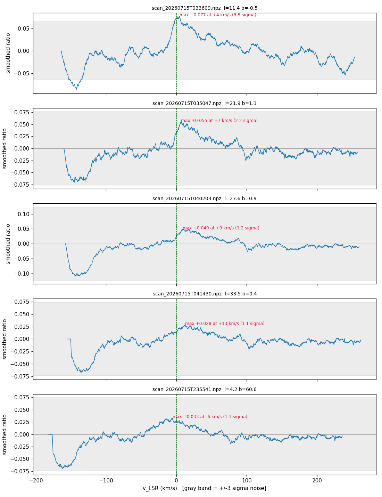
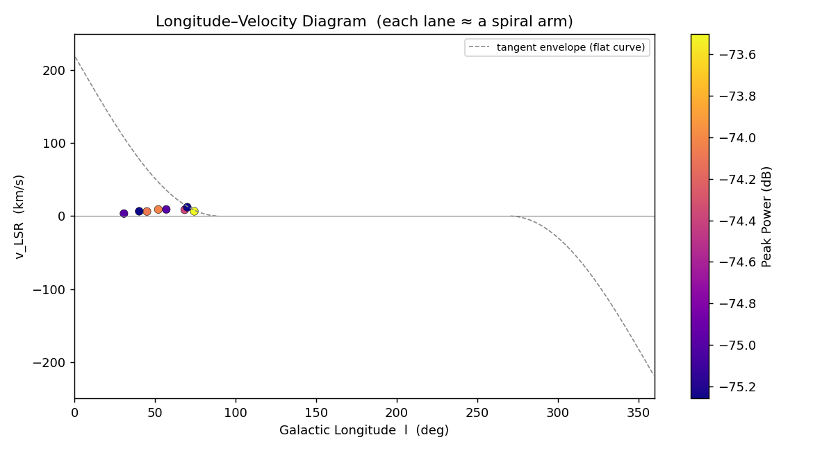
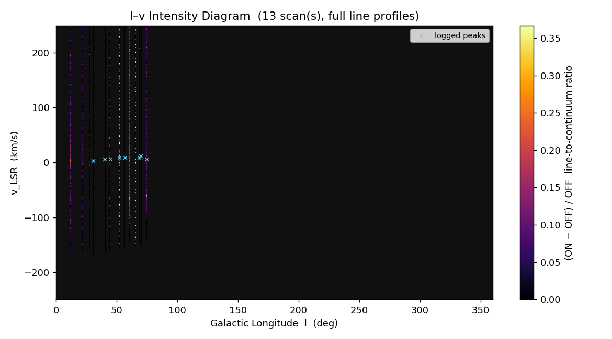
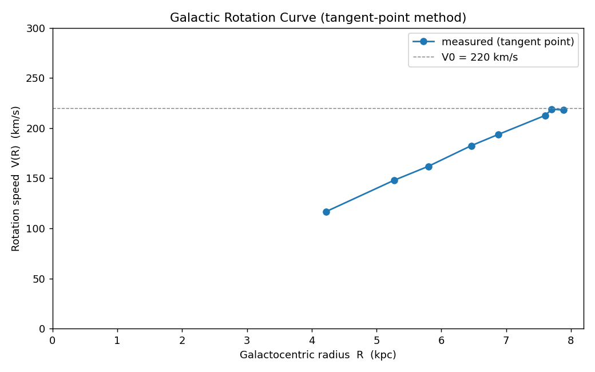
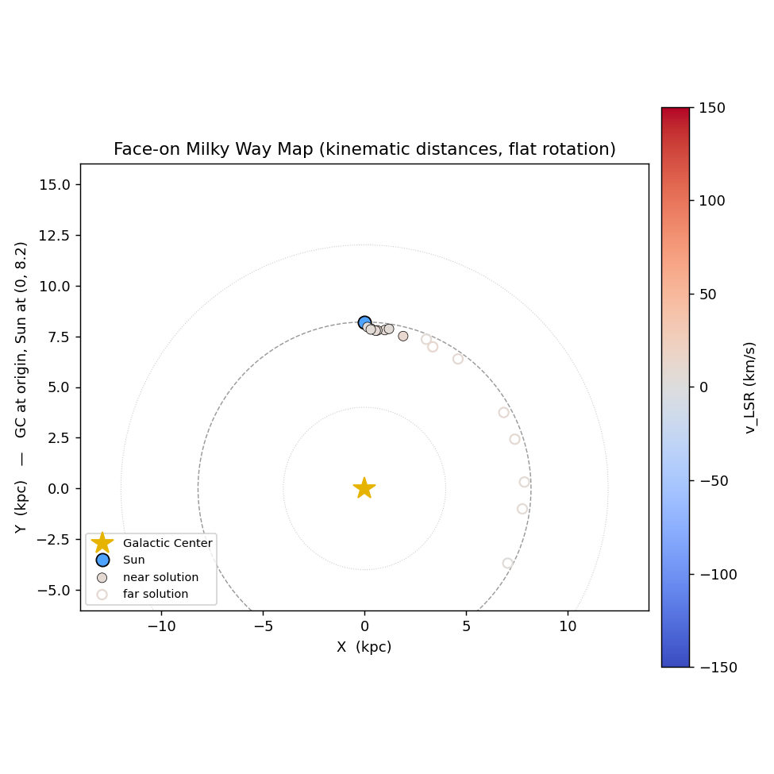

# Galactic HI Mapper

A DIY radio telescope that detects the **21 cm neutral-hydrogen line** (1420.405752 MHz)
from the Milky Way, and the desktop software that runs it end to end — live spectrometer,
observation planner, drift-scan integrator, observing log, and the analysis pipeline that
turns the log into longitude–velocity diagrams, a rotation curve and a face-on map.

Built and operated from a fixed backyard site on Long Island, NY (~40.7° N). The dish does
not steer: it points due south and the Earth's rotation carries the galactic plane through
the beam. All hardware is off-the-shelf, total cost on the order of a few hundred dollars.

**13 hydrogen detections across 5 nights, l = 11°–74°, 1.9 h of on-sky integration —
8 of them above 5σ.**

---

## Figures

### First light — the detection



Four on-plane drift scans from 2026-07-15 (top four panels), each ~3 minutes, plotted as
the baseline-subtracted line-to-continuum ratio `(ON − OFF)/OFF` against LSR velocity. Each
shows a broad emission bump rising near v_LSR ≈ 0 with a tail out to +80–100 km/s — the
signature of Quadrant-I galactic hydrogen, redshifted because we are looking inward along
a rotating disc. The bump weakens with increasing longitude, as expected.

The fifth panel is the off-plane scan (b = +60.6°) from the same night, which would make a
useful control except that it is the session in which the SDR was unplugged mid-integration
— its true exposure is unknown, so it cannot be compared against the others. It is shown
because that failure is what prompted the source-failure handling described below.

### Longitude–velocity diagrams

| Peak scatter | Full line profiles |
|---|---|
|  |  |

The left panel plots the logged peak of each scan; the right one rebuilds a true l–v
intensity image from every saved spectrum, so blended components the peak-finder cannot
split are still visible. The vertical striping is the sampling — 13 sightlines, not a
continuous survey.

### Rotation curve and face-on map

| Tangent-point rotation curve | Kinematic face-on map |
|---|---|
|  |  |

---

## Is the signal real?

The honest answer to "did this backyard dish actually detect the Milky Way" is not the
size of the bump — it is whether the bump moves with the sky. It does.

**The emission is locked to the sky, not to the receiver.** Across the five observing
nights the correction from the topocentric frame to the Local Standard of Rest varied over
a range of 22 km/s, as the Earth's orbital and rotational velocity projected differently
onto each sightline. If the feature were an instrumental artefact — a bandpass ripple, a
residual DC term, a fixed birdie — it would sit at a constant *frequency* and its apparent
LSR velocity would track that correction exactly. Instead:

| | across all 15 scans |
|---|---|
| Peak position in the LSR (sky) frame | **+6.1 ± 4.5 km/s** |
| Peak position in the topocentric (receiver) frame | −4.9 ± 7.1 km/s |
| Correlation of LSR correction with LSR peak velocity | **+0.18** |
| Correlation of LSR correction with topocentric peak velocity | −0.78 |

The feature holds still in the frame that is fixed to the galaxy and drifts in the frame
that is fixed to the receiver, which is what emission from an astronomical source is
required to do and what an artefact cannot fake. Combined with line widths of 46–256 kHz
(~10–55 km/s, correct for galactic HI), detections repeating on five separate nights, and
significance that grows with integration time, the conclusion is that this instrument is
seeing neutral hydrogen in the Milky Way.

Reproduce it with `python check_data_quality.py`, which runs this test and the three below
against the committed spectra.

## What the data does not yet support

**The rotation curve is not a measurement.** The tangent-point method assumes the most
extreme velocity along a sightline comes from the tangent point. The detector is instead
logging the bright local-gas peak near v_LSR ≈ 0: measured velocities span only −0.4 to
+12.6 km/s where inner-galaxy tangent velocities at l = 30–70° should reach +50 to +120.
What is plotted is therefore dominated by the geometric `V₀·sin l` term rearranged — it
will look convincingly flat while measuring almost nothing. The fix is a detector that
fits the terminal velocity of the profile rather than its peak.

The velocity extent of the emission bears this out. At high longitude, where the expected
tangent velocity is small, the profiles reach it; at low longitude, where the gas should
extend far further out in velocity, they fall well short:

| l | expected v_tangent | measured extent | integration | |
|---:|---:|---:|---:|---|
| 11° | +177 km/s | +24 km/s | 187 s | short by 150 km/s |
| 22° | +138 km/s | +33 km/s | 205 s | short |
| 28° | +118 km/s | +38 km/s | 201 s | short |
| 31° | +108 km/s | +46 km/s | 526 s | short |
| 40° | +78 km/s | +65 km/s | 734 s | short |
| 45° | +65 km/s | +72 km/s | 702 s | reaches it |
| 52° | +47 km/s | +68 km/s | 701 s | reaches it |
| 61° | +28 km/s | +51 km/s | 731 s | reaches it |
| 74° | +8 km/s | +32 km/s | 801 s | reaches it |

Every sightline with l ≥ 45° reaches its tangent velocity; every sightline below l = 40°
falls short, and the shortfall grows as the expected velocity does. Those are also the
shortest integrations and the lowest elevations, and the emission there is spread over a far
wider velocity range, so less of it lands in any one channel. Longer integrations at low
longitude are the single highest-value next session.

**Receiver gain drifts between the cold-sky baseline and the scan.** Measuring the
off-line continuum ratio, which should sit near zero, gives:

| drift | scans |
|---|---|
| under 5 % | 4 |
| 5–20 % | 8 |
| over 25 % | 3 (worst: 40 %) |

Only 8 distinct baselines were captured for 15 scans, and within each shared baseline the
later scans drift further — the receiver is warming and the OFF measurement goes stale.
Recapturing every ~20 minutes would remove most of this.

Importantly, this drift is degrading the data rather than manufacturing the signal: the
correlation between absolute drift and integrated line flux is +0.10, and the four scans
with the cleanest baselines include two of the strongest detections in the set.

**Two of fifteen on-plane scans are nulls.** The l = 58.3° and l = 65.5° scans from
2026-08-05 show no line at all despite 577 s and 608 s of integration and near-zero
baseline drift. Their cold-sky baseline is clean of HI, so the usual explanation — an OFF
measurement accidentally taken on the plane, which would cancel the line — does not apply.
This is unexplained and worth chasing.

**There is no valid off-plane control.** The one off-plane scan in the archive is the
corrupted 2026-07-15 session in which the SDR was unplugged mid-integration and the timer
ran for 19.4 hours; its exposure is unknown, so it cannot bound the false-positive rate.
A deliberate 10-minute scan at |b| > 30°, processed identically, is the cheapest single
measurement that would strengthen everything above.

**Scope.** 13 logged detections over 5 nights, all in Quadrant I (l = 11–74°), 1.9 hours
of on-sky integration, no outer-galaxy coverage.

## Hardware

Signal chain, in order:

```
parabolic mesh dish  →  LMR400  →  SAWbird+ H1 LNA  →  RG316  →  NESDR SMArTee v2  →  USB
   (20 dBi, 1.4 GHz)                (+40 dB, SAW @ 1420 MHz)      (RTL2832U + R820T2)
```

| Part | Role | Notes |
|---|---|---|
| Nooelec 20 dBi parabolic mesh dish | Collecting area | ~8–10° beam at 1.4 GHz |
| Nooelec SAWbird+ H1 | Low-noise amplifier | +40 dB, SAW filter centred on the HI line; must stay inline |
| Nooelec NESDR SMArTee v2 | Software-defined radio | RTL2832U + R820T2; **always-on 4.5 V bias-tee** powers the LNA, so there is nothing to switch on |

Mount is fixed in azimuth at 180° (due south). The only pointing control is elevation,
set with a phone inclinometer laid on the feed boom, or computed from tape-measure numbers
by `angle_calc.py`. On Windows the SDR needs the WinUSB driver installed once via Zadig.

> Photographs live in [`docs/hardware/`](docs/hardware/) — currently the bench setup
> indoors and the application interface. A photograph of the dish deployed outdoors is
> the one thing this repository is still missing.

---

## How the instrument works

It is a **meridian drift-scan telescope**, which is the part most people find
counter-intuitive:

- Elevation selects a *declination* — a horizontal stripe of sky.
- The *clock* selects which galactic longitude of that stripe is currently due south.
- You need both to hit a target. Elevation alone is not enough.

Galactic latitude `b` is therefore a live readout of how far the beam sits from the plane.
`b ≈ 0` means the plane is in the beam and it is time to integrate; the software shows this
as a colour-coded ON-PLANE banner rather than making you compute it. Because the site
latitude is fixed, every longitude maps to one permanent elevation forever — only the
transit time shifts ~4 minutes earlier each night.

From this latitude the reachable sky is l = 10°–80° (inner galaxy, all redshifted) and
l = 170°–265° (outer galaxy). Roughly l = 90°–165° transits north of zenith and
l = 275°–335° never rises; the software greys out those bands on every map so unreachable
sky is never mistaken for unobserved sky.

---

## Software

Two programs, no framework, no build step.

**`hydrogen_mapper.py`** — the acquisition application (PyQt6, dark theme, single file).
Live spectrum with a velocity axis in km/s along the top, live l–b coverage heatmap, live
longitude–velocity diagram, a target planner that converts a galactic longitude into an
elevation and a transit time, a "what can I see tonight?" listing of the next 12 hours,
cold-sky baseline capture, timed drift-scan integration, and CSV logging.

**`analyze_log.py`** — the offline pipeline. Reads the log plus the saved spectra and
writes the four figures above, with `--hardware-only`, `--min-snr` and `--fits` flags.

Points worth calling out to anyone reading the code:

- **All integration happens in linear power.** dB is display-only. Averaging in dB is
  biased and throws away SNR — the accumulator, the display EMA and the cold-sky baseline
  are all linear PSDs, and baseline subtraction is the ratio `(ON − OFF)/OFF`.
- **Detection runs on a spectrum smoothed to the line width** (50 kHz boxcar, ~85 bins).
  Real HI lines are 100–500 kHz wide, so per-bin they drown in radiometer noise. Smoothing
  to the expected width is what made the first detection visible at all.
- **Narrowband RFI is vetoed explicitly**: a candidate is rejected if a single raw bin
  holds more than 50 % of the kernel window's power — that is a coherent carrier, not
  thermal emission from a cloud.
- **Every row carries its own quality metrics** (`SNR_sigma`, `Line_FWHM_kHz`,
  `Integration_s`) so the analysis can filter non-detections after the fact rather than
  silently dropping them at record time. Peak frequency is refined by parabolic
  interpolation to sub-bin precision; FWHM has the smoothing kernel's broadening removed
  in quadrature.
- **Acquisition runs on a worker thread**, DSP included; all state, plotting and widget
  access stay on the GUI thread, so there are no locks anywhere.
- **Source failure is handled as a first-class case.** An early session lost an SDR
  mid-integration and the wall-clock timer happily "integrated" for 19.4 hours. Now a dead
  source times out in ~5 s, the scan is finalised with the data actually received, and
  `Integration_s` is the span from scan start to the last block received — so a row
  recorded late still describes where the dish was really looking.
- **`--self-test` runs the whole pipeline headless** against the simulator with a pinned
  UTC, and verifies the recorded CSV row, the saved spectrum and both maps. It writes to
  `selftest_log.csv`, never the real log.

The simulator generates synthetic IQ with a realistic noise floor, receiver bandpass, DC
spike and one injected HI line following a toy flat-rotation model. It is a flight
simulator for the workflow — it injects a single line on a smooth curve and therefore can
never show real spiral structure. Simulated and real rows share the log but every row is
tagged `Source`, so they can never be confused.

---

## Repository layout

```
hydrogen_mapper.py        acquisition app (PyQt6 GUI + DSP + logging)
analyze_log.py            offline analysis -> the four figures
check_data_quality.py     the four data-quality tests reported above
angle_calc.py             dish elevation from tape-measure numbers
galactic_plane_log.csv    the observing log (13 hardware detections)
spectra/*.npz             full averaged spectrum of every scan
*.png                     figures, regenerated by analyze_log.py
*.bat                     Windows double-click launchers
docs/OPERATING_GUIDE.md   full manual: hardware, procedure, science, code architecture
docs/GRAPHS_GUIDE.md      how to run a session and how to read every plot
docs/hardware/            photographs of the instrument
```

### Log schema

One row per detected velocity component (a single scan can log several — one per arm).

| Column | Meaning |
|---|---|
| `Timestamp_UTC` | Midpoint of the integration's actual data span |
| `Source` | `Hardware` or `Simulation` |
| `Lat_GPS`, `Lon_GPS` | Observer location (rounded to 0.1° here for privacy) |
| `Dish_Azimuth`, `Dish_Altitude` | Pointing; azimuth is always 180° |
| `Galactic_Longitude_L`, `Galactic_Latitude_B` | Solved beam position |
| `Peak_Frequency_MHz`, `Peak_Power_dB` | Measured line |
| `Doppler_Velocity_Topo_km_s` | Raw topocentric velocity (reference only) |
| `Doppler_Velocity_LSR_km_s` | Velocity in the Local Standard of Rest — the science number |
| `Component_Index`, `N_Components` | Which component of a multi-peak scan, and how many |
| `SNR_sigma` | Detection significance on the smoothed spectrum |
| `Line_FWHM_kHz` | Line width, corrected for detection smoothing |
| `Integration_s` | Span of data actually received |
| `Spectrum_File` | Path to that scan's saved spectrum |

---

## Running it

Requires **Python 3.13** (PyQt6/scipy/astropy wheels were not yet available for 3.14 at
time of writing).

```bash
git clone https://github.com/<your-username>/galactic-hi-mapper.git
cd galactic-hi-mapper
python -m pip install -r requirements.txt

python hydrogen_mapper.py            # launch the app (falls back to Simulation with no SDR)
python hydrogen_mapper.py --self-test   # headless pipeline check, prints PASS
python analyze_log.py --show --hardware-only   # regenerate the figures from the log
python check_data_quality.py                   # re-run the four data-quality tests
```

With no SDR attached the app detects this at startup and drops into Simulation mode, so
everything above runs on any machine. To reproduce the figures in this README exactly, the
committed log and spectra are all that is needed — no hardware required.

Windows users can double-click the `.bat` launchers instead; they locate Python
automatically, or honour a `HI_PYTHON` environment variable pointing at a specific
interpreter.

---

## Method and constants

Velocities use the radio convention, `v = c·(f_rest − f_obs)/f_rest`, positive = receding.
Topocentric velocities are corrected to the Local Standard of Rest using astropy's
barycentric correction plus the standard solar motion (U, V, W = 11.1, 12.24, 7.25 km/s,
Schönrich, Binney & Dehnen 2010). Galactic constants are R₀ = 8.2 kpc, V₀ = 220 km/s.
Kinematic distances assume flat rotation and are drawn with both near and far solutions,
because that ambiguity is inherent to the method and hiding it would be dishonest.

Further reading: the LAB HI survey longitude–velocity diagrams are the standard reference
to compare an amateur l–v diagram against.

---

## License

MIT — see [LICENSE](LICENSE).
